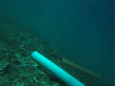
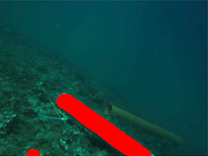

# Submarine Structure Detection

This repository aims to implement two methods for detecting submarine structures: line detection and k-means clustering. These methods can be used to identify and analyze various underwater features, such as pipelines, cables, and geological formations.

| Image 1 | Image 2 |
| --- | --- |
|  |  |
| *Caption for Image 1* | *Caption for Image 2* |

## Line Detection Method

The line detection method involves images to identify straight lines that may correspond to submarine structures. This method utilizes various image processing techniques, such as edge detection and Hough transforms, to identify and extract lines from the image data.

## K-Means Clustering Method

The k-means clustering method involves grouping similar data points into clusters based on their features or characteristics. In the context of submarine structure detection, this method can be used to group together similar patterns or structures within the sonar or acoustic image data.

## Evaluation

To evaluate the performance of each algorithm with the datasets used in this repository, simply run the command `./evaluate` in the directory where the datasets are located. The evaluation script will output the results of the analysis, including the accuracy and precision of each algorithm.

Please note that the datasets used in this repository are for demonstration purposes only and may not be suitable for real-world applications.

## Requirements

The following packages are required to run the algorithms and the evaluation script:
-OpenCV
- numpy
- matplotlib
- scikit-learn

These packages can be installed using pip or any other package manager.

## Usage

To use the algorithms in this repository, simply import the relevant module and call the appropriate function.
